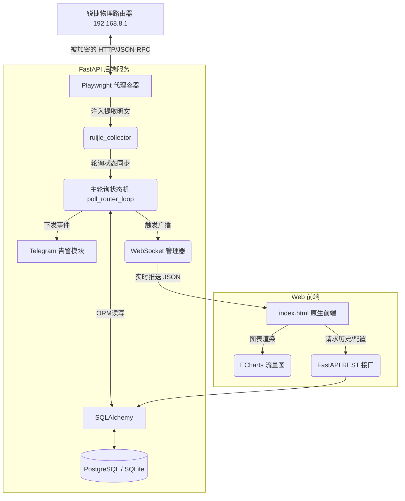

# 架构与方法论设计 (Architecture & Methodology)

## 1. 破解锐捷底层通信的方法论 (The Playwright Bridge)

### 痛点与挑战
锐捷星耀/睿易路由器（如 eWeb OS）的官方网页管理后台使用了极为苛刻的安全机制：
1. **动态 AES-CBC 加密**：所有请求的 Body（包括密码、指令）都被 `CryptoJS` 进行了 AES 加密。
2. **时效性密钥**：AES 的 Key 和 IV 是在登录瞬间由服务器动态下发的，且有严格的有效时长和会话绑定。
3. **JS 混淆与请求头签名**：除了 Body 加密，请求头（Headers）中还附带了基于请求时间戳、URL 和会话 Cookie 的动态签名（Sign）。

如果采用传统的 Python `requests` 或 `httpx` 逆向去硬算出所有加密逻辑，不仅代码难以维护，而且一旦锐捷更新固件修改了混淆算法，爬虫就会瞬间失效。

### 解决方案：Playwright 无头代理状态机
本项目**放弃了传统的硬逆向还原**，转而采用一种“降维打击”的方式——**浏览器自动化桥接**。
我们在后台常驻一个基于 `playwright` 的无头 Chromium 实例：
1. **真实环境渲染**：让浏览器真实加载路由器的原版 `app.js` 等所有前端代码。
2. **模拟真人登录**：输入账密，让原版前端代码去完成所有的动态密钥申请、Cookie 绑定和 AES 加密过程。
3. **注入 Fetch 拦截器 (Interceptor)**：通过 `page.route` 和注入 JavaScript 探针，直接在浏览器的运行内存中，拦截那些**已经被锐捷原版 JS 解密好的明文 JSON 数据**。
4. **长效保活**：系统每 3 秒触发一次假装刷新页面的操作，保证路由器的会话 Token 永远不过期。

通过这种方式，我们以极小的维护成本（无需关心加密算法的变更），直接拿到了原生、干净的内部 API 数据结构，如 `local_topology` (拓扑网络) 和 `user_list` (在线终端)。

---

## 2. 系统核心架构图 (Architecture)

系统采用前后端分离架构，通过 WebSocket 维系极低延迟的实时数据链路。

## 3. 数据库设计 (Database Schema)

系统不仅关注“当前状态”，更注重“历史沉淀”。
通过 `poll_router_loop` 轮询对比，我们构建了一个完善的状态机，用以生成连贯的连接档案：

- **`Device` 表**：记录每个 MAC 地址当前的最新状态（IP、最后上线时间、当前下行速率）。
- **`DeviceAlias` 表**：分离式的终端重命名表。即使用户重置了路由器，我们在本系统中修改的“张三的手机”别名依然存在。
- **`ConnectionHistory` 表 (核心档案)**：
  - 核心字段：`mac`, `session_start`, `session_end`, `ap_sn`, `ap_name`, `total_rx_bytes`, `total_tx_bytes`。
  - 逻辑：上线时生成一条 `session_end` 为 null 的记录。在设备在线期间，不断把原生底层接口上报的总消耗流量 `rx_bytes` 叠加到该记录上。当检测到离线时，闭合该记录。如果检测到漫游（`ap_sn` 发生变化），更新当前会话的物理位置。
- **`EventLog` 表**：偏向流式的告警日志表。仅在关键节点（如发生大流量、上线、离线、漫游）时写入一行日志，供 Telegram 推送和前端快速预览使用。

## 4. 扩展性与未来规划
目前系统已经完全跑通了“读取”链路。由于 Playwright 在后台已经持有了有效的认证 Cookie 和加密上下文，下一步可通过增加 `/api/ruijie/cmd` 透传网关，实现**反向控制**：
- 下发 `devSta.set` 踢掉某个正在下载大文件的设备。
- 动态调整路由器的访客 VLAN 配置。
- 定时自动重启远端 AP 节点。
